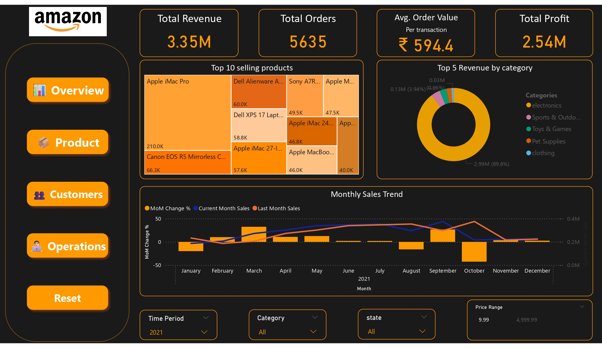
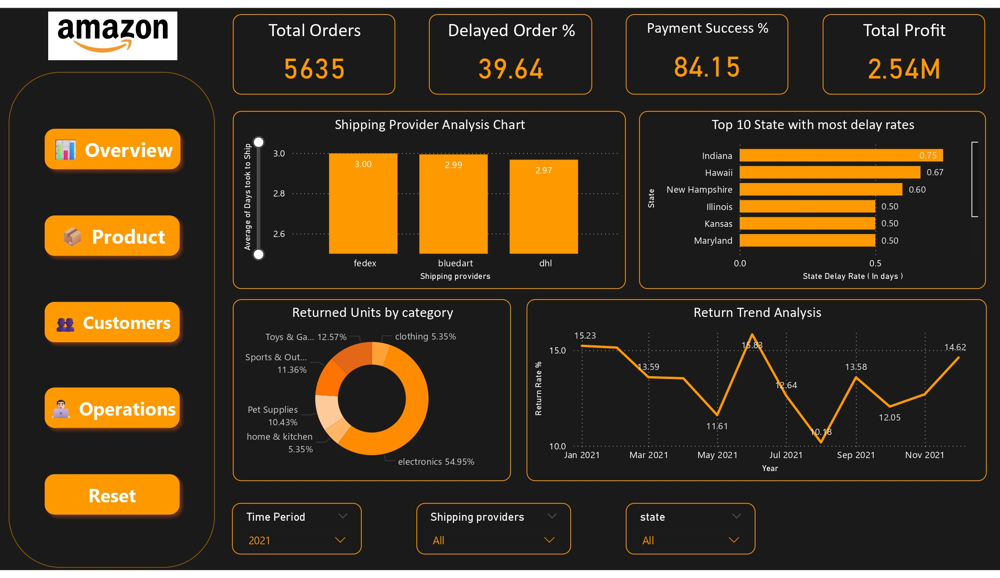

## Dashboard Pages

### 1. Overview

**Key Metrics:**
- Total Revenue: ₹3.35M
- Total Orders: 5,635
- Average Order Value: ₹594.4
- Total Profit: ₹2.54M

**Visualizations:**
- Top 10 selling products (Apple iMac Pro leading at ₹210K)
- Top 5 Revenue by category (Electronics 89.8%)
- Monthly Sales Trend with MoM Change %
- Interactive filter panes

### 2. Product Analysis

**Key Metrics:**
- YoY Growth: 37.63%
- Revenue by category with quarterly breakdown
- Inventory Stock Alerts for products below threshold

**Visualizations:**
- Profit Leaderboard showing 95% margins for top performers
- Quarterly revenue table by category
- Inventory alerts with last restocked dates
- Interactive "Ask a question about your data" feature

### 3. Customer Analysis

**Key Metrics:**
- Top 10 Customers by Customer Lifetime Value (CLTV)
- Top 5 Performing Sellers (Tech Armor, AnkerDirect, AmazonBasics, Ailun, iSaddle)

**Visualizations:**
- CLTV bar chart (range: ₹26K-₹33K)
- Top performing sellers treemap
- Interactive price range slider

### 4. Detailed Customer Analysis

**Key Metrics:**
- Total Customers: 898
- New Customers: 868 (96.7%)
- Returning Customers: 30 (3.3%)

**Visualizations:**
- Top Customers by CLTV with ranking
- Customer List Table showing orders vs returns
- Inactive Sellers tracking
- AOV analysis for customers with >5 orders

### 5. Operations

**Key Metrics:**
- Delayed Order %: 39.64%
- Payment Success %: 84.15%

**Visualizations:**
- Shipping Provider Analysis Chart
- Top 10 States with highest delay rates
- Returned Units by category (Electronics 54.95%)
- Return Trend Analysis (10.18%-15.83% range)

### 6. Detailed Operations Analysis

**Key Metrics:**
- Total Orders: 1,185
- Delayed Order %: 38.99%
- Payment Success %: 78.90%
- Total Profit: ₹558.50K

**Visualizations:**
- Shipping Delays table
- Provider Comparison chart
- Payment Status breakdown (26.7% refunded)
- Top Returned Products with 100% return rates

## Implementation
This dashboard transforms 20 complex SQL queries into visual insights that support decision-making across product management, customer relationships, inventory control, and logistics operations.

## 🛍️ Product Insights

- **Top Performer:** *Apple iMac Pro* generating **₹210K** in revenue.
- **Category Breakdown:**
  - Electronics: **89.8%**
  - Sports & Outdoors: **3.94%**
  - Toys & Games: **0.96%**
- **Profit Champions:** Top 6 products maintain exceptional **95% profit margins**.
- **Inventory Alerts:** Several Apple products require attention.
  - *iMac 24-inch* is critically low at **31 units**.
- **Return Rates:** Electronics account for **54.95%** of all returns.

---

## 👥 Customer Analysis

- **Customer Base:** 898 total customers.
  - Only **3.3%** (30) are returning customers.
- **High-Value Customers:** 
  - Top CLTV customer: *Henry Reed*, worth **₹33K** with **32 orders**.
- **Return Patterns:** Several customers show **100% return rates**—requires intervention.
- **AOV Segmentation:**
  - Customers with **>5 orders** average **₹591.80** per transaction.
- **Seller Performance:**
  - Top 5 sellers led by *Tech Armor* and *AnkerDirect*.

---

## ⚙️ Operational Efficiency

- **Shipping Delays:** **39.64%** of all orders experience delays.
- **Provider Performance:** 
  - *FedEx* shows the longest average shipping time at **3.0 days**.
- **Problem Areas:** 
  - *Indiana* has the highest delay rate at **0.75 days**.
- **Payment Processing:** 
  - **84.15%** payment success rate.
  - **26.7%** refund rate.
- **Return Trends:** 
  - Monthly return rates fluctuate between **10.18%** and **15.83%**.

---

## 🚨 Critical Action Items

- Rebalance inventory for low-stock Apple products.
- Investigate high return rates in the **Electronics** category.
- Address shipping delays with **FedEx** and in problematic states.
- Improve payment processing systems to reduce refund rates.
- Develop retention strategies for converting one-time buyers.

---

## 📈 Next Steps

Our analysis reveals significant opportunities for operational improvements and revenue growth. We recommend focusing on:

- **Customer Retention:** Convert more of our 868 new customers into returning ones.
- **Inventory Optimization:** Prioritize high-margin electronics.
- **Shipping Improvements:** Monitor and improve shipping provider performance.
- **Return Strategy:** Implement a plan to reduce return rates.

---

## Future Enhancements
- Integration with real-time data sources
- Predictive analytics for inventory management
- Customer segmentation machine learning model
- Mobile-optimized version for executives

🔍 *This project demonstrates how SQL can be used to extract actionable insights from sales data.*
